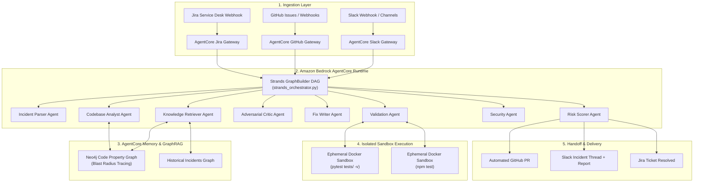
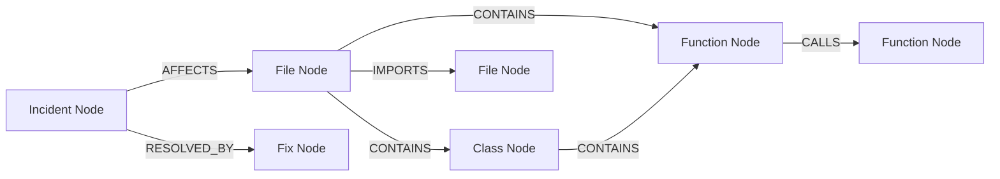

# Amaze on Work — System Architecture

> **AWS Agents for Humans Hackathon** — *Professional Agents Track*

---

## High-Level Architecture

Amaze on Work is a multi-agent engineering system built on **Strands Agents SDK** and deployed via **Amazon Bedrock AgentCore**. It resolves production incidents end-to-end: from alert ingestion to validated PR creation.



---

## Orchestration Engine

The primary orchestration is a **Strands GraphBuilder DAG** with conditional retry edges:

```
parse → retrieve → analyze → review → fix → validate → secure → score
                                                ↑ retry ↓
                                                fix ← validate (on regression)
```

| Node | Strands Agent | Tool(s) | Purpose |
|------|--------------|---------|---------|
| `parse` | Incident Parser | `parse_incident_tool` | Extract structured context from GitHub Issues |
| `retrieve` | Knowledge Retriever | `knowledge_retriever_tool` | Query graph for historical incidents & fix patterns |
| `analyze` | Codebase Analyst | `analyze_codebase_tool`, `query_blast_radius_tool` | Graph-first root cause localization |
| `review` | Adversarial Critic | `review_analysis_tool` | Tech Lead review of root cause hypothesis |
| `fix` | Fix Writer | `generate_fix_tool` | Generate minimal unified diff patch |
| `validate` | Validation Agent | `run_sandbox_tests_tool` | Before/after test delta in Docker sandbox |
| `secure` | Security Agent | `security_review_tool` | STRIDE/OWASP vulnerability scan |
| `score` | Risk Scorer | `assess_risk_and_report_tool`, `create_pr_tool` | Composite risk score + auto-PR creation |

A fallback **SupervisorAgent** (`src/agents/supervisor.py`) provides the same pipeline as a while-loop engine, used when Strands graph execution encounters issues.

---

## Agent Architecture

### Strands Agents SDK Integration

Each agent is a native `strands.Agent` with domain-specific `@tool`-decorated functions:

```python
from strands import Agent, tool

@tool
def parse_incident_tool(incident_id: str, owner: str, repo: str) -> str:
    """Parse GitHub issue into structured incident context."""
    ...

parser_agent = Agent(
    name="incident_parser",
    tools=[parse_incident_tool, fetch_github_file_tool],
    system_prompt="...",
)
```

### Amazon Bedrock AgentCore Mapping

| Amaze on Work Component | Bedrock AgentCore Primitive | Function |
|:---|:---|:---|
| Strands GraphBuilder (`strands_orchestrator.py`) | **AgentCore Runtime** | Serverless multi-agent execution |
| GitHub / Slack / Jira MCP (`src/mcp/`) | **AgentCore Gateway** | IAM-authenticated tool gateway |
| Neo4j GraphRAG (`src/graph/`) | **AgentCore Memory** | Persistent code property graphs |
| Docker Sandbox (`src/sandbox/`) | **AgentCore Sandbox** | Ephemeral containerized test isolation |

---

## Knowledge Graph Design (GraphRAG)

The system uses a pluggable graph backend architecture:

- **Neo4j** — persistent graph for production deployments
- **NetworkX** — in-memory fallback for local/offline operation

Graph nodes and relationships:



Key capabilities:
- **Blast radius estimation** — traverse callers 2-3 hops deep
- **Historical incident lookup** — find past fixes for similar errors
- **Dependency tracing** — import graph analysis for impact assessment
- **Knowledge Retriever** — runs before codebase analysis to provide historical context

---

## Docker Sandbox Validation

Fixes are validated in isolated containers to prevent host contamination:

1. Clone target repository into ephemeral container
2. Run baseline tests (capture pass/fail counts)
3. Apply patch via `git apply`
4. Re-run tests (capture new pass/fail counts)
5. Compute test delta: regressions, fixes confirmed, unrelated failures

Sandbox images:
- `amaze-python:base` — Python service tests (`pytest tests/ -v`)
- `amaze-node:base` — Node service tests (`npm test`)

---

## Security Gate

The Security Agent runs between validation and risk scoring:

- **OWASP Top 10** pattern detection (injection, broken auth, XSS, etc.)
- **STRIDE** threat modeling (spoofing, tampering, repudiation, etc.)
- **CWE** classification of findings
- **SOC2** control mapping

Verdict: `PASS` (no critical/high issues) or `REVIEW_REQUIRED` (manual review needed).

---

## Risk-Tiered Deployment

The Risk Scorer computes a composite score (0-100) from:

| Factor | Weight | Source |
|--------|--------|--------|
| Blast radius | 20% | Graph traversal (downstream callers) |
| Test coverage | 20% | Sandbox before/after delta |
| Change complexity | 15% | Lines changed, cyclomatic delta |
| File churn | 15% | Historical bugfix frequency |
| Coupling score | 15% | fan_in × fan_out |
| Environment severity | 15% | Production vs staging vs dev |

Deployment actions:
- **LOW (0-24)** → Auto-create PR with fix
- **MEDIUM (25-49)** → PR with alternatives, notify Slack
- **HIGH (50-100)** → Report only, escalate to human

---

## Enterprise Integrations (FastMCP)

| Platform | MCP Server | Capabilities |
|----------|-----------|-------------|
| **GitHub** | `src/mcp/github_server.py` | Fetch issues, file content, create PRs, commit patches |
| **Slack** | `src/mcp/slack_server.py` | Post progress updates, resolution reports, fix options |
| **Jira** | `src/mcp/jira_server.py` | Fetch/create tickets, update status, add comments, link PRs |

---

## Deployment

```bash
# Local execution via Strands CLI
python strands_agent.py --incident INC-001

# Bedrock AgentCore deployment
python agentcore_app.py
agentcore deploy

# Interactive demo
python demo.py --incident INC-004 --slack-channel C0AL8NG5J79
```
