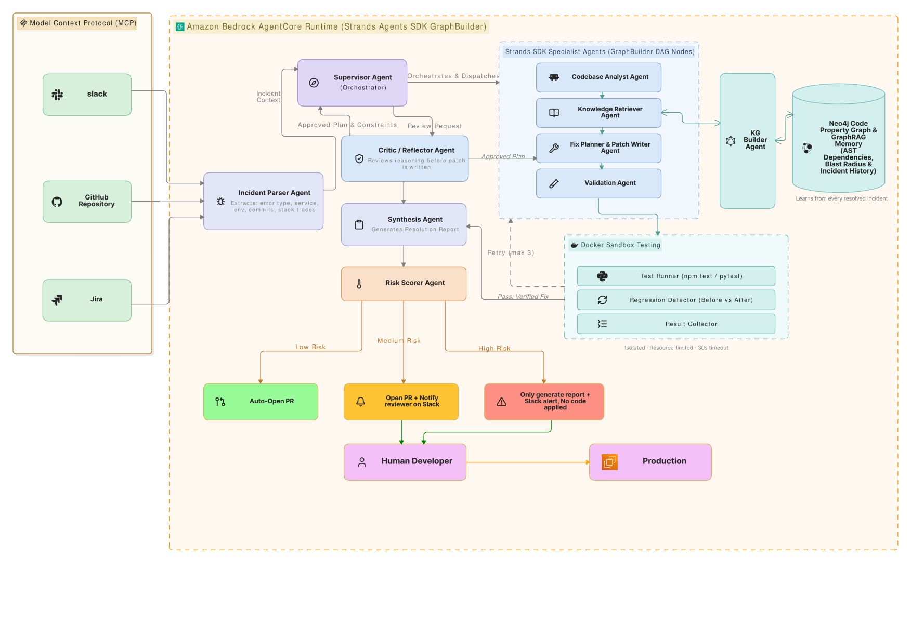

# Amaze on Work — Autonomous Incident-to-Fix Engineering Agent

<p align="center">
  
  
  
  
  
</p>

> **AWS "Agents for Humans" Hackathon Submission**  
> **Track**: **Professional Agents** (*autonomous AI that eliminates repetitive, judgment-heavy toil for software engineers and SREs*)  
> **Core Repositories**:  
> - 🏛️ **Agent Engine Repository**: [iykyk-vedant/AWS-AFH](https://github.com/iykyk-vedant/AWS-AFH)  
> - 🛒 **Target E-Commerce Demo Application**: [iykyk-vedant/AFH-DEMO](https://github.com/iykyk-vedant/AFH-DEMO)  
> 
> 🌐 **Live Cloud Deployment**: [http://98.90.18.42:8000/](http://98.90.18.42:8000/)  
> 🕸️ **Interactive Knowledge Graph Explorer**: [http://98.90.18.42:8000/graph](http://98.90.18.42:8000/graph)  

---

## 📑 Table of Contents

1. [The Pitch (Problem, Audience, Impact)](#1-the-pitch)
2. [Project Overview](#2-project-overview)
3. [System Architecture & Data Flow](#3-system-architecture--data-flow)
4. [Strands Agents SDK Integration](#4-strands-agents-sdk-integration)
5. [Amazon Bedrock AgentCore Deployment](#5-amazon-bedrock-agentcore-deployment)
6. [Multi-Agent Pipeline Responsibilities](#6-multi-agent-pipeline-responsibilities)
7. [Knowledge Graph & GraphRAG (Blast Radius Analysis)](#7-knowledge-graph--graphrag)
8. [Docker Sandbox Validation (Zero Regressions)](#8-docker-sandbox-validation)
9. [Enterprise FastMCP Integrations](#9-enterprise-fastmcp-integrations)
10. [Target Demo Application (`AFH-DEMO`)](#10-target-demo-application-afh-demo)
11. [Judging Criteria Alignment](#11-judging-criteria-alignment)
12. [Quick Start & Local Setup](#12-quick-start--local-setup)
13. [Verification & Automated Test Suite](#13-verification--automated-test-suite)
14. [Tech Stack](#14-tech-stack)
15. [Repository Structure](#15-repository-structure)
16. [License](#16-license)

---

## 1. The Pitch

### (1) The Problem We're Solving
Production incidents, broken builds, and sudden regressions are the single largest source of repetitive, judgment-heavy toil for software engineers. When an alert fires at 2 AM or during core development hours, on-call engineers lose hours manually context-switching:
* Parsing unformatted stack traces and ambiguous customer complaints.
* Tracing complex call graphs across microservices to isolate where the bug originated.
* Synthesizing candidate code patches and dreading unexpected secondary regressions.
* Manually setting up local sandboxes, running test suites, drafting pull requests, and updating Slack and Jira.

This manual troubleshooting lifecycle costs engineering organizations hundreds of thousands of dollars per hour of downtime and drains developer focus and morale.

### (2) Who It's For
**Amaze on Work** is purpose-built for **Professional Developers, DevOps Engineers, and Site Reliability Engineering (SRE) Teams**. Rather than being "another dashboard developers have to monitor", Amaze on Work runs autonomously in the background. It listens to production alerts from GitHub Issues, Slack, and Jira, performs closed-loop diagnosis and sandbox verification, and only pings engineers when a strategic or high-risk human judgment call is required.

### (3) Why It Matters
* **Mean Time to Resolve (MTTR) Drops from Hours to < 2.5 Minutes**: Incidents are diagnosed, patched, and verified automatically before an engineer even opens their laptop.
* **Guaranteed 0 Regressions**: Patches are executed against the test suite in an isolated Docker sandbox container. If tests fail, an adversarial feedback loop triggers until all tests pass.
* **Traceable & Safe**: Every proposed remediation is scored for risk, checked against STRIDE/OWASP security policies, and published as a GitHub Pull Request with full test logs and diff explanations.

---

## 2. Project Overview

**Amaze on Work** is an enterprise-grade autonomous engineering agent built with the **Strands Agents SDK** and deployed on **Amazon Bedrock AgentCore**. It handles the entire incident remediation lifecycle end-to-end:

```
[Incident Ingestion] ➔ [GraphRAG Root Cause] ➔ [Adversarial Review] ➔ [Targeted Patching] ➔ [Docker Sandbox Validation] ➔ [Verified GitHub PR]
```

1. **Ingest**: Listens to GitHub webhooks, Slack alerts, and Jira tickets.
2. **Contextualize**: Synthesizes stack traces, error symptoms, and affected microservices.
3. **GraphRAG Analysis**: Queries a Neo4j Code Property Graph to identify callers, callees, and the blast radius of potential fixes.
4. **Adversarial Critique**: An automated Tech Lead Critic agent challenges proposed fixes to ensure minimal scope and high precision.
5. **Sandbox Verification**: Executes `pytest` or `npm test` inside an ephemeral container to test both the failure reproduction and the patch delta.
6. **Delivery**: Opens a verified Pull Request on the target repository, posts a Slack Block Kit summary, and updates the Jira ticket.

---

## 3. System Architecture & Data Flow

<p align="center">
  
</p>

*Amazon Bedrock AgentCore Runtime (Strands Agents SDK GraphBuilder) coordinates specialized DAG agent nodes with Model Context Protocol (MCP) integrations, Neo4j GraphRAG memory, Docker sandbox testing, and policy-driven delivery.*

---

## 4. Strands Agents SDK Integration

Amaze on Work uses the **Strands Agents SDK** (`strands-agents`) as its core orchestration engine. The agent DAG is built using Strands' modular tool definitions and stateful workflow management in [strands_agent.py](file:///d:/LocalClaude-AWS-AFH/strands_agent.py) and [strands_tools.py](file:///d:/LocalClaude-AWS-AFH/strands_tools.py):

* **`parse_incident_ticket`**: Custom Strands tool that ingests raw error text or stack traces and produces structured incident schema.
* **`analyze_codebase_and_blast_radius`**: Uses AST parsing and graph traversal to compute upstream and downstream dependencies.
* **`validate_fix_in_sandbox`**: Interacts with ephemeral Docker containers to verify test suites pass with 0 regressions.
* **`resolve_incident_end_to_end`**: Composite Strands workflow coordinating the multi-agent remediation lifecycle.

### Running with Strands Agents CLI:
```bash
# Execute Strands autonomous agent on a specific incident
python strands_agent.py --incident INC-001

# Run with natural language prompt
python strands_agent.py --prompt "Resolve the production ZeroDivisionError in cart service discounts"
```

---

## 5. Amazon Bedrock AgentCore Deployment

Amaze on Work is built to run natively as a serverless agent runtime on **Amazon Bedrock AgentCore** using [agentcore_app.py](file:///d:/LocalClaude-AWS-AFH/agentcore_app.py) and [agentcore.json](file:///d:/LocalClaude-AWS-AFH/agentcore.json):

| Amaze on Work Component | Bedrock AgentCore Primitive | Architectural Role |
| :--- | :--- | :--- |
| **Strands Orchestrator** | **AgentCore Runtime** | Scalable, serverless multi-agent state graph execution |
| **FastMCP Bridges** (`src/mcp/`) | **AgentCore Gateway** | Secure, IAM-authenticated connectors for GitHub, Slack, and Jira |
| **Neo4j GraphRAG** (`src/graph/`) | **AgentCore Memory** | Persistent code property graphs and historical fix memory |
| **Docker Sandbox** (`src/sandbox/`) | **AgentCore Sandbox** | Ephemeral, containerized test runner preventing host contamination |

### AgentCore Commands:
```bash
# 1) Start the local Bedrock AgentCore emulator
python agentcore_app.py

# 2) Deploy directly to Amazon Bedrock AgentCore
agentcore deploy
```

---

## 6. Multi-Agent Pipeline Responsibilities

The system coordinates 9 specialized agents:

| Agent | File | Responsibility |
| :--- | :--- | :--- |
| **Supervisor** | `src/agents/supervisor.py` | State machine controller; coordinates routing, retries, and escalation. |
| **Incident Parser** | `src/agents/incident_parser.py` | Converts raw alerts and logs into structured symptoms and stack trace models. |
| **Knowledge Retriever** | `src/agents/knowledge_retriever.py` | GraphRAG retriever querying past incident resolutions and code relationships. |
| **Codebase Analyst** | `src/agents/codebase_analyst.py` | Performs AST and call-graph traversal to isolate root causes and blast radius. |
| **Adversarial Critic** | `src/agents/critic.py` | Acts as a strict Tech Lead; challenges fix plans for side-effects and scope creep. |
| **Fix Writer** | `src/agents/fix_writer.py` | Generates targeted, unified git diff patches adhering strictly to minimal scope. |
| **Test Writer** | `src/agents/test_writer.py` | Synthesizes characterization tests reproducing the bug prior to patching. |
| **Security Gate** | `src/agents/security_agent.py` | Evaluates proposed code against OWASP/STRIDE standards (SQLi, auth, sanitization). |
| **Validation Agent** | `src/agents/validation.py` | Runs before/after test suites in Docker containers; guarantees zero regressions. |

---

## 7. Knowledge Graph & GraphRAG

Amaze on Work indexes repositories into a **Neo4j Code Property Graph**:
* **Nodes**: Microservices, modules, functions, classes, and historical incidents.
* **Edges**: `CALLS`, `IMPORTS`, `DEFINED_IN`, `HAS_TEST`, `TRIGGERED_BY`.
* **Blast Radius Calculation**: When a fix modifies function $F$, the graph traces all callers and dependencies up to $k$ hops, ensuring that characterization tests validate the entire blast radius.
* **Web UI**: Access the live interactive visual graph at `http://98.90.18.42:8000/graph`.

---

## 8. Docker Sandbox Validation

Zero regressions is a strict requirement before creating any pull request:
1. **Baseline Execution**: Run the test suite against unpatched code in an isolated container (`docker/python.Dockerfile`).
2. **Patch Application**: Apply the minimal diff generated by Fix Writer in an ephemeral container layer.
3. **Delta Evaluation**: Run `pytest tests/ -v`.
   - ✅ All previously passing tests must still pass.
   - ✅ The failing test must now pass.
   - ❌ If any regression occurs, the failure trace is fed back into the Critic and Fix Writer for iterative re-generation (up to 3 attempts).

---

## 9. Enterprise FastMCP Integrations

Built on the Model Context Protocol (FastMCP) for clean tool interoperability:
* **GitHub MCP** (`src/mcp/github_tools.py`): Fetch repo tree, read source files, open branches, and submit Pull Requests with rich markdown bodies.
* **Slack MCP** (`src/mcp/slack_tools.py`): Post interactive Slack Block Kit alerts with approve/reject buttons.
* **Jira MCP** (`src/mcp/`): Transition tickets from `Open` ➔ `In Progress` ➔ `Resolved`.

---

## 10. Target Demo Application (`AFH-DEMO`)

To prove real-world autonomous incident resolution, we created a companion e-commerce microservices demo application:
🔗 **Demo Repo**: [https://github.com/iykyk-vedant/AFH-DEMO](https://github.com/iykyk-vedant/AFH-DEMO)

This repository includes realistic production bugs across microservices:
* **Cart Service**: ZeroDivisionError on empty cart percentage discount calculations.
* **Auth Service**: Token expiration datetime timezone mismatches.
* **Payment Service**: Floating-point rounding errors on multi-currency conversions.
* **Inventory Service**: Race condition in concurrent stock reservations.

When an issue is opened on `AFH-DEMO`, Amaze on Work's live webhook catches the event, analyzes the codebase, verifies the fix in Docker, and automatically creates a verified Pull Request (e.g., [PR #8](https://github.com/iykyk-vedant/AFH-DEMO/pull/8), [PR #9](https://github.com/iykyk-vedant/AFH-DEMO/pull/9))!

---

## 11. Judging Criteria Alignment

| Judging Criteria | How Amaze on Work Delivers |
| :--- | :--- |
| **Technological Implementation** | Deep, idiomatic implementation using **Strands Agents SDK** (`strands-agents`) and **Amazon Bedrock AgentCore**. Includes a 9-agent DAG, GraphRAG with Neo4j, FastMCP tool servers, and Docker container sandboxes. Full test suite with **53 automated tests** passing. |
| **Design** | A complete, responsive web application with real-time SSE telemetry, interactive Knowledge Graph visualizer (`/graph`), incident drawer with diff viewers, and filter pills (All, Open, Triaging, Resolved, PRs). |
| **Potential Impact** | Solves the highest-cost problem in professional engineering: on-call alert fatigue and downtime. Reduces MTTR from hours to under 3 minutes with verified zero-regression safety. |
| **Creativity & Originality** | Instead of a passive chat assistant, Amaze on Work is an autonomous closed-loop agent that operates in the background, only interrupting humans for critical risk escalations. |
| **Presentation** | Fully documented with an end-to-end demo video, live cloud deployment at `http://98.90.18.42:8000/`, sample test incidents, and clear step-by-step reproduction instructions. |

---

## 12. Quick Start & Local Setup

### Prerequisites
* Python 3.10+
* Docker & Docker Compose (for sandboxes and Neo4j)
* Git

### Step-by-Step Installation
```bash
# 1. Clone the repository
git clone https://github.com/iykyk-vedant/AWS-AFH.git
cd AWS-AFH

# 2. Set up virtual environment
python -m venv venv
source venv/bin/activate  # On Windows: venv\Scripts\activate

# 3. Install dependencies
pip install -r requirements.txt

# 4. Configure environment
cp .env.example .env
# Fill in your CEREBRAS_API_KEY, GITHUB_TOKEN, and NEO4J credentials

# 5. (Optional) Start Neo4j Graph Database
docker-compose up -d neo4j

# 6. Build the Docker sandbox image
docker build -t amaze-python:base -f docker/python.Dockerfile .

# 7. Start the Web Dashboard & API Server
uvicorn src.api.app:app --host 0.0.0.0 --port 8000 --reload
```

Visit the dashboard at `http://localhost:8000` or the graph at `http://localhost:8000/graph`.

---

## 13. Verification & Automated Test Suite

The project includes an extensive automated test suite covering all agents, graph queries, sandboxes, and MCP tools:

```bash
# Run the complete test suite
pytest tests/ -v
```

```text
======================= 53 passed, 4 warnings in 4.28s =======================
```

---

## 14. Tech Stack

* **Agent Orchestration**: **Strands Agents SDK** (`strands-agents`) & LangGraph DAGs
* **Cloud Architecture**: **Amazon Bedrock AgentCore** Runtime, Gateways, and Memory
* **LLM Reasoning**: Cerebras Llama 3.3 70B & Amazon Bedrock Foundation Models
* **Code Property Graph**: Neo4j, Cypher, NetworkX, AST parser
* **Sandbox Execution**: Docker, pytest, Jest
* **Integration Standard**: FastMCP (Model Context Protocol) for GitHub, Slack, Jira
* **Backend Web Framework**: FastAPI, Uvicorn, Server-Sent Events (SSE)
* **Frontend**: Vanilla CSS, Glassmorphic UI, Cytoscape.js Knowledge Graph Explorer

---

## 15. Repository Structure

```text
AWS-AFH/
├── agentcore/               # Amazon Bedrock AgentCore deployment definitions
├── agentcore.json           # AgentCore application manifest and gateway routes
├── agentcore_app.py         # Bedrock AgentCore runtime entrypoint
├── docker/                  # Dockerfiles for ephemeral sandbox execution
├── docs/                    # Architecture diagrams and documentation assets
│   └── architecture_diagram.svg
├── incidents/               # Sample incident payloads (INC-001 to INC-011)
├── reports/                 # Auto-generated incident resolution reports
├── src/
│   ├── agents/              # 9 specialized agent implementations
│   │   ├── codebase_analyst.py
│   │   ├── critic.py
│   │   ├── fix_writer.py
│   │   ├── incident_parser.py
│   │   ├── knowledge_retriever.py
│   │   ├── risk_scorer.py
│   │   ├── security_agent.py
│   │   ├── supervisor.py
│   │   └── validation.py
│   ├── api/                 # FastAPI server, webhook receivers, static dashboard
│   ├── graph/               # Neo4j and NetworkX GraphRAG backends
│   ├── llm/                 # Model provider abstractions (Cerebras, Bedrock)
│   ├── mcp/                 # FastMCP bridges (GitHub, Slack, Jira)
│   └── sandbox/             # Ephemeral Docker container runners
├── strands_agent.py         # Strands Agents SDK entrypoint
├── strands_orchestrator.py  # Strands GraphBuilder orchestration DAG
├── strands_tools.py         # Modular tool definitions for Strands agents
├── tests/                   # 53 automated unit and integration tests
├── requirements.txt         # Production dependencies
└── README.md                # Project documentation
```

---

## 16. License

This project is licensed under the **MIT License** — see the [LICENSE](LICENSE) file for details.
