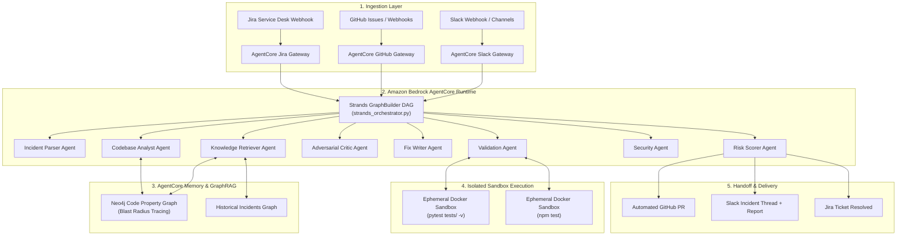

# Amaze on Work — Autonomous Incident-to-Fix Engineering Agent

> **AWS Agents for Humans Hackathon** — *Professional Agents Track*


An agentic platform that resolves software incidents end-to-end: from incident ingestion to root-cause analysis, minimal patch generation, sandbox validation, and delivery-ready reporting.

---

## Table of Contents
1. Project Overview
2. Problem Statement
3. System Architecture (Strands + Bedrock AgentCore)
4. Strands Agents SDK Integration
5. Amazon Bedrock AgentCore Deployment
6. System Workflow & Multi-Agent Architecture
7. Agent Responsibilities
8. Knowledge Graph Design (GraphRAG)
9. Docker Sandbox Validation
10. FastMCP Integrations
11. Reporting and Outputs
12. Risk Scoring Strategy
13. Quick Start
14. Tech Stack
15. Repository Structure
16. Configuration

---

## 1. Project Overview

Amaze on Work is a multi-agent engineering system that automates the full incident resolution lifecycle:

- Accept incidents from GitHub and Slack
- Build structured incident context
- Analyze code and dependencies
- Generate a minimal patch
- Validate changes in an isolated Docker sandbox
- Produce reports and handoff artifacts for teams

The platform uses a stateful agent graph and a code knowledge graph to improve accuracy, reduce regressions, and support iterative retries when fixes fail validation.

---

## 2. Problem Statement

Most incident handling workflows are still manual and slow:

1. Parse issue text and logs
2. Identify root cause in a large codebase
3. Propose a safe fix
4. Run tests and evaluate regressions
5. Communicate findings to stakeholders

These steps are difficult to scale, especially for teams handling multiple incidents in parallel. Amaze on Work addresses this by coordinating specialized agents with strict validation and risk-aware output decisions.

---

## 3. System Architecture (Strands + Bedrock AgentCore)

Amaze on Work is architected following the **Amazon Bedrock AgentCore** reference design and powered by the **Strands Agents SDK**:



---

## 4. Strands Agents SDK Integration

Amaze on Work exposes its core capabilities as native **Strands Tools** via the `strands-agents` SDK in [strands_agent.py](file:///d:/LocalClaude-AWS-AFH/strands_agent.py):

* **`parse_incident_ticket`**: Ingests raw stack traces and extracts structured incident symptoms.
* **`analyze_codebase_and_blast_radius`**: Uses AST parsing and Neo4j GraphRAG to calculate call graph dependencies.
* **`validate_fix_in_sandbox`**: Runs test suites inside ephemeral Docker containers to verify 0 regressions.
* **`resolve_incident_end_to_end`**: Coordinates the entire lifecycle from ticket ingestion to PR creation.

### Running with Strands Agents:
```bash
# Run Strands agent on a specific incident ticket
python strands_agent.py --incident INC-001

# Run with natural language prompt
python strands_agent.py --prompt "Fix production 500 error in auth login"
```

---

## 5. Amazon Bedrock AgentCore Deployment

Amaze on Work is packaged to run as a serverless agent runtime on **Amazon Bedrock AgentCore** using [agentcore_app.py](file:///d:/LocalClaude-AWS-AFH/agentcore_app.py) and [agentcore.json](file:///d:/LocalClaude-AWS-AFH/agentcore.json):

| Amaze on Work Component | Bedrock AgentCore Primitive | Architectural Function |
| :--- | :--- | :--- |
| **Strands Coordinator** ([strands_agent.py](file:///d:/LocalClaude-AWS-AFH/strands_agent.py)) | **AgentCore Runtime** | Serverless, scalable execution of autonomous multi-agent loops |
| **GitHub / Slack / Jira MCP** (`src/mcp/`) | **AgentCore Gateway** | IAM-authenticated tool gateway connecting enterprise tools |
| **Neo4j GraphRAG** (`src/graph/`) | **AgentCore Memory** | Persistent code property graphs and historical resolution memory |
| **Docker Sandbox** (`src/sandbox/`) | **AgentCore Sandbox** | Ephemeral containerized test isolation preventing regressions |

### Deploying to AgentCore:
```bash
# 1) Test locally in AgentCore emulator
python agentcore_app.py

# 2) Deploy infrastructure to AWS Bedrock AgentCore
agentcore deploy
```

---

## 6. System Workflow & Multi-Agent Architecture

1. Incident arrives through GitHub, Slack, or Jira webhook.
2. Incident Parser extracts structured fields (severity, stack traces, service, symptoms).
3. Strands Coordinator routes work to specialist agents.
4. Codebase Analyst and Knowledge Retriever build root-cause context via Neo4j GraphRAG.
5. Critic checks fix strategy for quality and minimal scope.
6. Fix Writer generates a focused, minimal patch.
7. Validation Agent runs sandbox checks and compares baseline vs patched behavior.
8. Synthesis Agent creates a resolution narrative.
9. Risk Scorer assigns LOW, MEDIUM, or HIGH risk.
10. System generates PR, updates Jira ticket, and posts to Slack.

---

## 7. Agent Responsibilities

| Agent | File | Responsibility |
|------|------|----------------|
| Supervisor | src/agents/supervisor.py | Controls orchestration and retry routing |
| Incident Parser | src/agents/incident_parser.py | Converts raw incident text to structured context |
| Knowledge Retriever | src/agents/knowledge_retriever.py | Pulls historical incidents and fix patterns from graph |
| Codebase Analyst | src/agents/codebase_analyst.py | Performs graph-first root cause localization |
| Critic | src/agents/critic.py | Adversarial Tech Lead review of root cause analysis |
| Fix Writer | src/agents/fix_writer.py | Generates focused, minimal remediation patches |
| Test Writer | src/agents/test_writer.py | Generates characterization tests for validation |
| Validation | src/agents/validation.py | Runs before/after test delta in Docker sandbox |
| Security | src/agents/security_agent.py | STRIDE/OWASP security gate on proposed fixes |
| KG Builder | src/agents/kg_builder.py | Builds and updates code property graph |
| Synthesis | src/agents/synthesis.py | Produces consolidated resolution report |
| Risk Scorer | src/agents/risk_scorer.py | Composite risk scoring and deployment policy |
| Web Researcher | src/agents/web_researcher.py | StackOverflow fallback after failed LLM retries |

---

## 8. Knowledge Graph Design (GraphRAG)

Amaze on Work uses pluggable graph backends:

- Neo4j backend for persistent graph queries
- NetworkX fallback for local/offline operation

Graph components are implemented under src/graph, including backend factory, query interface, and base graph abstractions.

Key graph use cases:

- Blast radius estimation
- Historical incident lookup
- Dependency relationship tracing
- Context enrichment for better fix planning

---

## 9. Docker Sandbox Validation

Validation is performed in isolated containers to prevent host contamination and improve reproducibility.

- Python sandbox image: docker/python.Dockerfile
- Node sandbox image: docker/node.Dockerfile
- Orchestrator: src/sandbox/docker_runner.py

Validation flow:

1. Capture baseline test result
2. Apply patch in sandbox context
3. Re-run tests
4. Detect regressions and classify outcome

---

## 10. FastMCP Integrations

The system integrates with MCP bridges for external tooling:

- GitHub integration for issue and PR workflows
- Slack integration for incident ingestion and notifications

Relevant modules:

- src/mcp/github_server.py
- src/mcp/github_tools.py
- src/mcp/slack_server.py
- src/mcp/slack_tools.py
- src/mcp/client_bridge.py

---

## 11. Reporting and Outputs

Report generation lives in src/reports/report_generator.py with template support under src/reports/templates.

Output channels include:

- Incident resolution JSON artifacts (for traceability)
- PR-friendly markdown summaries
- Slack message summaries for operational visibility

Sample report data can be found in reports/INC-004_report.json.

---

## 12. Risk Scoring Strategy

Risk scoring combines:

- Scope of code impact
- Validation confidence
- Incident severity
- Change complexity

Policy examples:

- LOW: suggest automated continuation
- MEDIUM: human review recommended
- HIGH: report-only with escalation guidance

---

## 13. Quick Start

```bash
# 1) Create or activate environment
python -m venv venv
venv\Scripts\activate

# 2) Install dependencies (including Strands & AgentCore)
pip install -r requirements.txt

# 3) (Optional) Start Neo4j via Docker Compose
docker-compose up -d

# 4) Run via Strands Agents SDK
python strands_agent.py --incident INC-001

# 5) Run Bedrock AgentCore local entrypoint
python agentcore_app.py

# 6) Run interactive terminal demo flow
python demo.py --incident INC-004 --slack-channel C0AL8NG5J79

# 7) Run batch evaluation
python demo_batch.py
```

---

## 14. Tech Stack

| Component | Technology |
|-----------|------------|
| **Agent Framework** | **Strands Agents SDK** (`strands-agents`) & LangGraph |
| **Cloud Deployment** | **Amazon Bedrock AgentCore** Runtime, Gateways, Memory |
| **LLM Inference** | Cerebras Llama 3.3 70B & Amazon Bedrock |
| **Knowledge Graph** | Neo4j Code Property Graph (GraphRAG), NetworkX |
| **Sandbox Execution** | Ephemeral Docker Containers (pytest / Jest) |
| **Enterprise Integrations** | FastMCP tools (GitHub, Slack, Jira) |
| **API & Webhooks** | FastAPI & Uvicorn |
| **Reporting Engine** | Jinja2 templates & Rich console |

---

## 15. Repository Structure

```text
src/
    agents/   # Agent implementations and workflow state
    api/      # FastAPI app and webhook routes
    graph/    # Graph backends and query interface
    llm/      # LLM client abstractions and providers
    mcp/      # MCP bridges and platform tool wrappers
    reports/  # Report generation and templates
    sandbox/  # Containerized validation utilities
    utils/    # Shared utilities

tests/      # Test and integration helper scripts
docker/     # Dockerfiles for runtime/sandbox images
reports/    # Generated incident report outputs
```

---

## 16. Configuration

Create an environment file and configure required values.

Suggested variables:

- CEREBRAS_API_KEY
- GITHUB_TOKEN
- SLACK_BOT_TOKEN
- NEO4J_URI
- NEO4J_USER
- NEO4J_PASSWORD

The runtime configuration entrypoint is src/config.py.

---
