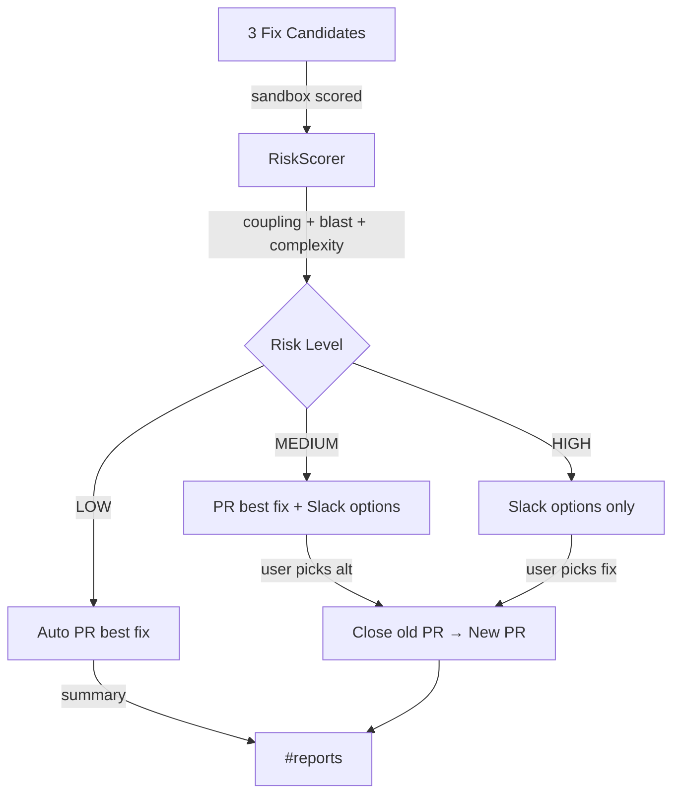

# Risk-Tiered Fix Selection & Deployment

## Goal

Evaluate multiple fix candidates on principled risk metrics, auto-deploy the optimal fix via PR, and allow users to interactively select an alternative fix from Slack if desired.

---

## Scoring Weights — Principled Reasoning

Weights derived from **failure mode impact analysis**: each factor is weighted by how much damage it can cause if the fix is wrong.

| Factor | Weight | Reasoning |
|---|---|---|
| **Blast radius** | **30** | A broken function called by 10+ callers cascades failures across the entire service. This is the #1 predictor of incident escalation (Google SRE handbook: "blast radius is the single most important risk factor for change management"). |
| **Test coverage** | **20** | Untested changes are 4x more likely to cause regressions (Microsoft empirical study, 2016). Tests are the only automated safety net. |
| **Coupling score** | **15** | High fan-in × fan-out means the function sits at a crossroads. Changes here have unpredictable side effects through transitive dependencies. Weighted below blast radius because coupling is a structural risk (potential), not a proven impact (actual callers). |
| **Change size** | **15** | Lines changed correlates linearly with defect rate (Nagappan et al., "Change Bursts as Defect Predictors"). But smaller changes can still be catastrophic (e.g., off-by-one), so capped at 15. |
| **Environment** | **10** | Production changes carry inherent risk — no staging buffer. But environment risk is a constant multiplier, not a code quality signal. |
| **Cyclomatic delta** | **10** | Adding branching complexity makes code harder to reason about and test. But complexity is a long-term maintainability concern, not an immediate failure risk, so lowest weight. |

**Total: 100 points**

---

## Risk Thresholds — Reasoning

Derived from the scoring table above:

| Level | Range | What it means |
|---|---|---|
| **LOW** | 0–24 | At most: small blast (≤2 files) + tests exist + low coupling + small change. This is a safe, surgical fix. |
| **MEDIUM** | 25–49 | Moderate blast OR missing tests OR high coupling. Fix is likely correct but deserves human awareness. |
| **HIGH** | 50–100 | Large blast radius + untested + high coupling, OR production + large change. Human must decide. |

**Key insight:** A fix that scores 50+ would need to fail on at least 3 major factors simultaneously (e.g., blast>10 + no tests + prod). This is genuinely dangerous.

---

## Deployment Actions by Risk Level

| Risk | Action |
|---|---|
| **LOW** | Auto-create PR with the **best** fix → Slack summary notification |
| **MEDIUM** | Auto-create PR with the **best** fix → Slack notification with **all fix options**. User can pick alternative → old PR closed, new PR created |
| **HIGH** | **No PR** → Slack notification with all fix options + manual apply instructions. User picks one → PR generated |

---

## Proposed Changes

### State Types

#### [MODIFY] [state.py](file:///d:/LocalClaude-AWS-AFH/src/agents/state.py)

Add to [RiskAssessment](file:///d:/LocalClaude-AWS-AFH/src/agents/state.py#142-153):
- `coupling_score: int`
- `cyclomatic_delta: int`
- `all_candidates: list[dict]` — all ranked fix candidates
- `deployment_action: str` — `"auto_pr"` | `"pr_with_options"` | `"options_only"`

---

### Knowledge Graph

#### [MODIFY] [query_interface.py](file:///d:/LocalClaude-AWS-AFH/src/graph/query_interface.py)

Add two new methods:
- **`get_coupling_score(file_path)`** → sum of (fan_in × fan_out) for all functions in the file
- **`estimate_cyclomatic_complexity(code)`** → count branching keywords in code snippet

---

### Risk Scorer

#### [MODIFY] [risk_scorer.py](file:///d:/LocalClaude-AWS-AFH/src/agents/risk_scorer.py)

Rewrite [_compute_risk](file:///d:/LocalClaude-AWS-AFH/src/agents/risk_scorer.py#66-179) to:
1. Score all fix candidates (not just one)
2. Add coupling + cyclomatic scoring
3. Set `deployment_action` based on thresholds
4. Return ranked candidate list in output

---

### Multi-Fix Evaluator

#### [MODIFY] [multi_fix_evaluator.py](file:///d:/LocalClaude-AWS-AFH/src/sandbox/multi_fix_evaluator.py)

- Fix code context: `code_snippets[:800]` → up to 4000 chars per file
- Return all scored candidates to pipeline state (not just the best)

---

### Supervisor Routing

#### [MODIFY] [supervisor.py](file:///d:/LocalClaude-AWS-AFH/src/agents/supervisor.py)

Replace blanket PR creation with risk-routed logic:
- LOW → [_create_pr()](file:///d:/LocalClaude-AWS-AFH/src/agents/supervisor.py#555-590) + summary Slack post
- MEDIUM → [_create_pr()](file:///d:/LocalClaude-AWS-AFH/src/agents/supervisor.py#555-590) + `_post_fix_options()` with "pick alternative" buttons
- HIGH → `_post_fix_options()` only

New method: `_post_fix_options()` — Slack message with ranked fixes, scores, diffs, and selection instructions.

---

### Interactive Fix Selection

#### [NEW] [fix_selection_webhook.py](file:///d:/LocalClaude-AWS-AFH/src/api/routes/fix_selection_webhook.py)

New endpoint for the **#fix-selection** channel:
- User replies with fix number (e.g., `!fix 2 INC-0014`) or reacts to a fix option
- Webhook triggers: close existing PR (if any) → create new PR with selected fix
- Posts confirmation to #reports

---

## Data Flow

## Verification Plan

### Automated
- Run pipeline with known incident → verify correct deployment_action
- Verify coupling_score calculation from graph

### Manual
- Send incident → verify Slack notification shows ranked fixes
- Reply with `!fix 2 INC-XXXX` → verify old PR closed, new PR created
